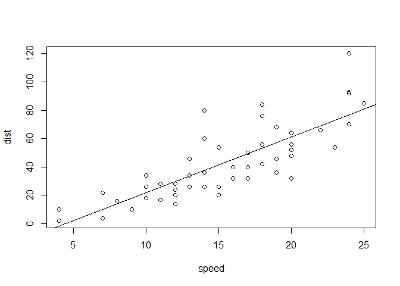

This is a paragraph in an R Markdown document.

Below is a code chunk:

    fit = lm(dist ~ speed, data = cars)
    b   = coef(fit)
    plot(cars)
    abline(fit)

The slope of the regression is -17.5790949.
